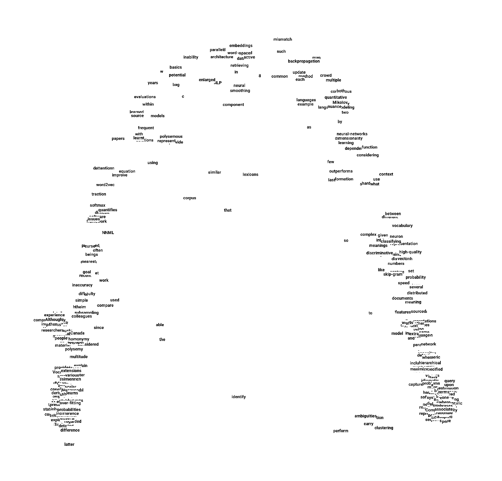
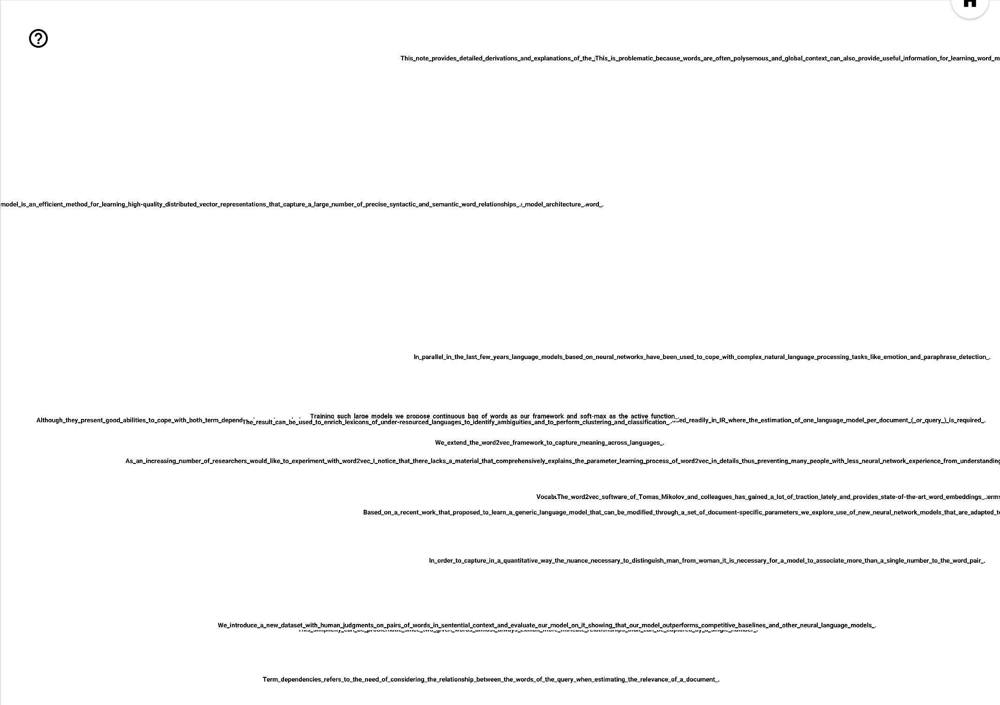

# parse2vec

sample code for generating parse tree embeddings and parse tree enriched word embeddings


parse tree embeddings nearest neighbour sample results:

```
nearest(VB) = VP
nearest(JJR) = RBR
nearest(CONJP) = AUX
...
```



parse tree enriched word embeddings sample results:

```
nearest(crowd) = multiple, man, ...
nearest(hierarchical) = relationship, soft-max ...
nearest(Sutskever) = Greg, Kai, ...
...
```
 
 
 
parse tree enriched sentence embeddings sample results: 
```
nearest(In order to capture in a quantitative way the nuance necessary to distinguish man from woman ...) = 
 - In parallel in the last few years language models based on neural networks have been used to cope with complex natural language processing tasks like emotion and paraphrase detection.
 - Based on a recent work that proposed to learn a generic language model that can be modified through a set of document-specific parameters we explore use of new neural network models that are adapted to ad-hoc IR tasks.

nearest(We introduce a new dataset with human judgments on pairs of words in sentential context and ...) =
 - The result can be used to enrich lexicons of under-resourced languages to identify ambiguities and to perform clustering and classification .
 - We consider the conditional probabilities p(c|w) and given a corpus Text the goal is to set the parameters θ of p(c|w;θ) so as to maximize the corpus probability .
...
```