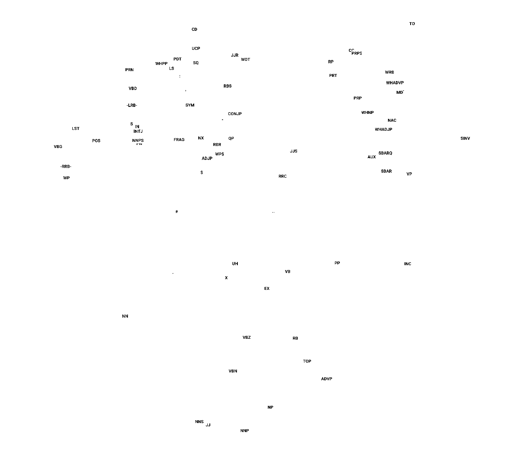

# parse2vec

sample code for generating parse tree embeddings and parse tree enriched word embeddings



sample nearest neighbour results:

```
nearest(VB) = VP
nearest(JJR) = RBR
nearest(CONJP) = AUX
...
```
